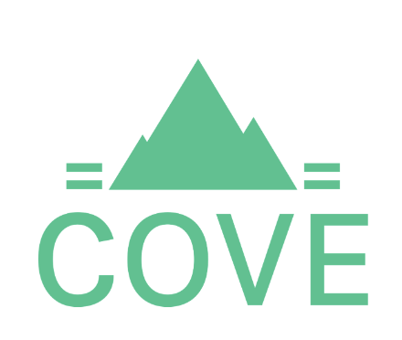

# Cove

This repo contains the backend verification[^1] code for Cove, a simple, reliable, open-source **co**ntract **ve**rification built for an L2 centric Ethereum ecosystem.

## Why?

The current state of smart contract verification has a lot of room for improvement:

- Verification often fails, with no useful feedback as to why.
  - There are over 200 total [Foundry](https://github.com/foundry-rs/foundry/issues?q=etherscan+verification) and [Hardhat](https://github.com/NomicFoundation/hardhat/issues?q=etherscan+verification) verification issues.
- Every Layer 2 chain has a different block explorer.
  - Need to manually verify with each verification provider.
  - Verifying on every single chain doesn't scale for developers.
- Verified contracts are not linked to git commits.
  - Hard to verify the audited code is what’s actually deployed.
  - Hard to verify yourself if you don't trust the hosted verification.
- 1:1 mapping of verification providers to UIs.
  - Anyone can spin up a novel frontend to interact with a smart contract, but not to view verified contracts.

## The State of Cove

- [x] Verify contracts in forge projects with just a repo URL, commit hash, and contract address.[^2]
- [x] Verify contracts on all supported chains with a single API call.
- [x] Verify both creation code and deployed code, along with the metadata hash, and return the the status of each.
- [x] Return decompiled bytecode, ABI, and Solidity for unverified contracts.[^3]
- [ ] More robust verification for all contracts (i.e. smarter bytecode matching and fallbacks).
- [ ] Save verified contracts to a publicly available database.
- [ ] Support other development frameworks such as Hardhat and Ape.
- [ ] Support other languages such as Vyper and Huff.
- [ ] Publish the Cove backend as a crate for easy local verification.
- [ ] Multi-file verification orders files logically.
- [ ] Automatically verify on Etherscan and Sourcify after successful verification.
- [ ] Support traditional methods of verification (e.g. standard JSON input).
- [ ] Build a first-party UI to showcase the functionality of Cove.

## Development

### Getting Started

Run `cp .env.template .env` and fill in the environment variables.
Then run `cargo run` to start the server or `cargo test` to run tests.

Formatting and linting use the latest nightly version of Rust, and clippy warnings are treated as errors.
Therefore use:

- `cargo +nightly fmt` to format the code.
- `cargo +nightly clippy --all --all-features -- -D warnings -W clippy::missing_docs_in_private_items` to lint the code.
- `RUSTDOCFLAGS='-D missing_docs' cargo doc --workspace --all-features --no-deps` to lint the docs.

Deployment is done with a docker container so all dependencies (e.g. git and foundry) can be installed in the container.
To build the docker image, run `docker build --tag cove .` in the root directory.
To start a container from that image, run `docker run --env-file .env -p 8000:8000 cove`

### How it Works

All methods and modules are documented, so the best way to gain an understanding of the code is to read the docs.
This can be done by running `cargo doc --open --document-private-items` and reading about each of the modules and methods.

Much of the structure is based on the book [Zero To Production In Rust](https://www.zero2prod.com), which is a great resource for learning how to build a production-ready Rust applications.

[^1]: The frontend can be found in the [ScopeLift/cove-frontend](https://github.com/ScopeLift/cove-frontend) repo.

[^2]: Creation transaction hashes and forge build profiles are required for now to reduce verification time and RPC usage.

[^3]: Thanks to [heimdall-rs](https://github.com/Jon-Becker/heimdall-rs) by @Jon-Becker.
